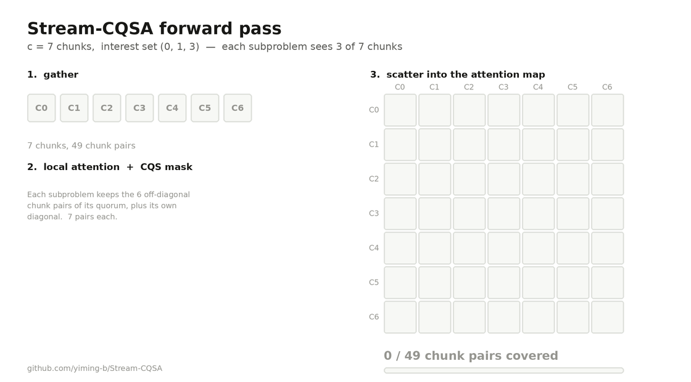
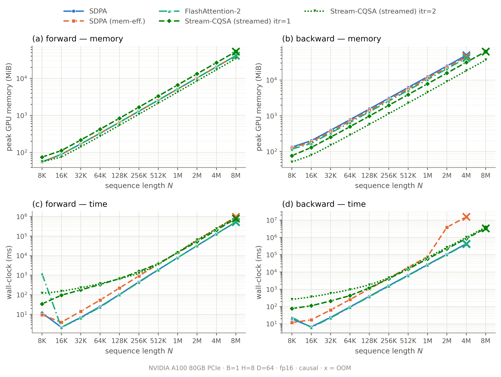
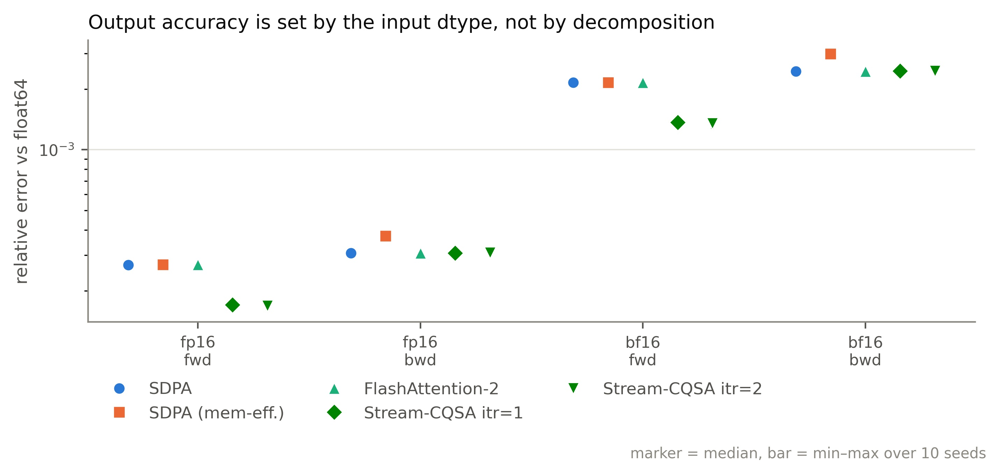

# Stream-CQSA

**Exact attention that still returns an answer where FlashAttention-2 runs out of memory.**

Stream-CQSA decomposes one attention call into a set of smaller ones using a
*cyclic quorum set* (CQS) over the sequence, runs them one at a time, and
recomposes their local softmax statistics into the exact global result. The
decomposition is a partition of the query–key pairs, so nothing is dropped,
sampled, or approximated: the output is the attention function, not a surrogate
for it.

The practical consequence is a knob that trades wall-clock time for peak device
memory, and keeps turning after the monolithic kernel has already failed.

📄 **Paper:** [arXiv:2604.20819](https://doi.org/10.48550/arXiv.2604.20819) —
*Stream-CQSA: Avoiding Out-of-Memory in Attention Computation via Flexible
Workload Scheduling*

<p align="center">
  
</p>

The forward pass in one loop: seven subproblems, each seeing only **three of the
seven** chunks, together cover **every one of the 49 chunk pairs exactly once** —
nothing dropped, nothing double-counted. That is why the recomposed output is
*exact* rather than an approximation.

🧮 **Interactive walkthrough:** **[open the demo](https://claude.ai/code/artifact/c4e4c79d-9184-4ed9-aa4e-8543181f7b75)**
— every step of the method, forward and backward, recomputed live as you change
`c`, the interest set, depth, causality, and where the fp32 accumulator lives.
Source in [`docs/demo/`](docs/demo/); it is a single self-contained file, so
opening it locally works just as well.

---

## Results

Causal attention, `B=1 H=8 D=64`, fp16, NVIDIA A100 80GB. Each cell is
**wall-clock / peak device memory**, where peak is
`torch.cuda.max_memory_allocated()`.

Three Stream-CQSA configurations appear, and the distinction matters:

| column | decomposition depth | fp32 accumulator | what it is for |
|:---:|:---:|:---:|:---:|
| `itr=1` | **fixed** at 1 | **on GPU** | tracing the trade curve at a pinned depth |
| `itr=2` | **fixed** at 2 | **on GPU** | as above, one step deeper |
| `itr=auto`, acc=CPU | **automatic** | **on host** | **the configuration you should actually use** |

The two fixed-depth columns are measurements, not recommendations — they exist
so the time/memory trade is visible as a curve. The third column is what
`stream_cqsa_auto` now runs by default: it picks the depth itself and keeps both
O(N) terms off the device, which is why it is expected to be the last column
standing at 16M. **Those runs are still in the queue**; the
cells are marked *pending* rather than estimated.

In normal use you never pick a depth yourself — see
[On choosing the depth](#on-choosing-the-depth).

### Backward

| N | SDPA | SDPA<br>mem-eff | FA-2 | CQSA itr1<br>acc=GPU | CQSA itr2<br>acc=GPU | CQSA auto<br>acc=CPU |
|:---:|:---:|:---:|:---:|:---:|:---:|:---:|
| **1M** | 26<br>12.1 | 78<br>11.1 | 25<br>10.1 | 57<br>7.6 | 68<br>**4.4** | *pending* |
| **2M** | 106<br>24.1 | 3860<br>22.1 | 101<br>20.1 | 218<br>15.3 | 262<br>**8.9** | *pending* |
| **4M** | 429<br>48.3 | 15421<br>44.3 | 407<br>40.3 | 854<br>30.5 | 998<br>**17.7** | *pending* |
| **8M** | **OOM** | **OOM** | **OOM** | 3372<br>61.1 | 3895<br>**35.5** | *pending* |
| **16M** | **OOM** | **OOM** | **OOM** | **OOM** | *pending* † | *pending* |

Each cell is **wall-clock seconds** (top) over **peak GiB** (bottom).
`FA-2` is FlashAttention-2; `CQSA` is Stream-CQSA.

† **Why `itr=2` acc=GPU has no 16M number yet.** It is not an OOM — it was never
attempted. The sweep retired a method from all larger N once it OOMed, but keyed
that on the base method name rather than on `(method, itr)`, so when `itr=1`
OOMed at 16M the whole family was marked dead and `itr=2` was skipped without
being run. That is a harness bug, since fixed, and the cell is now queued.
Whether it survives is genuinely open: `itr=2` used 35.5 GiB at 8M and that term
is linear in N, so 16M projects to ~71 GiB against the card's 79.3 GiB —
plausible, but too close to call without running it.

**This is where the method pays off.** At 8M every baseline is out of memory and
Stream-CQSA finishes, on the same card with the same numerics. And it is not
only a fallback: at 4M it does the backward in 17.7 GiB against
FlashAttention-2's 40.3 GiB — **2.3× less peak memory** — because raising the
depth shrinks the in-flight working set while the inputs stream from host
memory. The price is **2.1–2.7×** the time.

At 16M even the acc=GPU configuration runs out: the fp32 accumulator is itself
O(N) on the device. That is exactly the term the acc=CPU column removes, and
why it is the last column standing.

### Forward

| N | SDPA | SDPA<br>mem-eff | FA-2 | CQSA itr1<br>acc=GPU | CQSA itr2<br>acc=GPU | CQSA auto<br>acc=CPU |
|:---:|:---:|:---:|:---:|:---:|:---:|:---:|
| **1M** | 8<br>5.0 | 15<br>5.0 | 8<br>5.0 | 14<br>6.5 | 15<br>**4.2** | *pending* |
| **2M** | 32<br>10.1 | 61<br>10.0 | 32<br>10.1 | 53<br>13.0 | 64<br>**8.3** | *pending* |
| **4M** | 131<br>20.1 | 245<br>20.0 | 130<br>20.1 | 203<br>25.9 | 237<br>**16.7** | *pending* |
| **8M** | 520<br>40.3 | 966<br>40.0 | 532<br>40.3 | 796<br>51.8 | 907<br>**33.3** | *pending* |
| **16M** | **OOM** | **OOM** | **OOM** | **OOM** | *pending* † | *pending* |

Same units: **seconds** over **peak GiB**.

**The forward story is more modest, and worth stating plainly.** In the acc=GPU
configuration Stream-CQSA does *not* extend the forward's OOM boundary: every
method here reaches 8M and fails at 16M. What it buys is headroom at a given N
— 33.3 GiB against FlashAttention-2's 40.3 GiB at 8M (**0.83×**) — for
**1.5–2.0×** the time. At `itr=1` it actually uses *more* memory than the
baselines (1.29×), because the fp32 accumulator is an extra O(N) device term.

The reason is structural: the forward's peak is dominated by the inputs and the
accumulator, both O(N) on the device, and neither shrinks with depth. Moving the
accumulator to the host is what should carry the forward past 16M — the pending
column.



### What it costs

Below the OOM boundary, Stream-CQSA is **slower and, in the forward, uses more
device memory** than the baselines it is meant to rescue. That is the trade, and
the repository does not hide it:

Ratios against FlashAttention-2 over N = 1M–8M, fp16 (min–max across N):

| | | time | peak memory |
|:---:|:---:|:---:|:---:|
| forward | `itr=1` | 1.49–1.81× | 1.29× |
| forward | `itr=2` | 1.70–1.99× | **0.83×** |
| backward | `itr=1` | 2.10–2.26× | 0.76× |
| backward | `itr=2` | 2.45–2.70× | **0.44×** |

The memory ratios are strikingly constant across N — the decomposition shrinks
the working set by a fixed factor set by `itr`, not by anything N-dependent.

**Use FlashAttention-2 when it fits.** Reach for Stream-CQSA when it does not,
or when you need the backward's memory headroom more than you need the 2×.

One incidental finding worth flagging: PyTorch's **memory-efficient SDPA backend
is a severe outlier in the backward** — 15 421 s at 4M against FlashAttention-2's
407 s, a factor of 38 — while using *more* memory than Stream-CQSA `itr=2`. If
you are reaching for that backend for long-context training, measure it.

### Accuracy

Every number is measured **against a float64 reference**, not against SDPA —
SDPA is one of the methods under test, not the yardstick. N=8192, 10 seeds.

**Forward** — relative error vs float64:

| method | fp16 | bf16 |
|:---:|:---:|:---:|
| SDPA | 2.689e-04 | 2.168e-03 |
| FlashAttention-2 | 2.689e-04 | 2.168e-03 |
| **Stream-CQSA `itr=1`** | **1.705e-04** | **1.375e-03** |
| **Stream-CQSA `itr=2`** | **1.681e-04** | **1.356e-03** |

**Backward** — relative error vs a *dense* float64 reference:

| method | fp16 | bf16 |
|:---:|:---:|:---:|
| SDPA | 3.075e-04 | 2.458e-03 |
| FlashAttention-2 | 3.075e-04 | 2.458e-03 |
| Stream-CQSA `itr=1` | 3.080e-04 | 2.462e-03 |
| Stream-CQSA `itr=2` | 3.085e-04 | 2.465e-03 |

Three claims this supports:

- **Decomposition costs no accuracy.** Backward error is flat in `itr` to three
  significant figures; error does **not** compound as subproblems are merged.
- **The forward is ~1.6× *more* accurate than the baselines.** Not a rounding
  artefact: Stream-CQSA's statistics and output path are fp32 while the
  baselines round the output to fp16.
- **The floor is the input dtype, not the method.** bf16/fp16 = 8.0–8.1×
  everywhere, exactly the mantissa ratio (10 vs 7 explicit bits, 2³ = 8).



> **One caveat, stated plainly.** When attention is close to uniform, the
> backward's `dS = P(dP − D)` suffers catastrophic cancellation, and
> decomposition amplifies it (each subproblem's `dP` is further from the global
> `D` it is differenced against). At an input scale of 0.05 the `dQ` error
> drifts 3.5e-03 → 8.5e-03 from `itr=0` to `itr=2`. At realistic score
> magnitudes (scale ≥ 0.5) the drift vanishes entirely, and the undecomposed
> baseline is *already* 11× degraded in that regime — it is a property of the
> input, not of the method. Details in [docs/METHODOLOGY.md](docs/METHODOLOGY.md).

---

## Layout

```
stream_cqsa/            the package
  stable_stream.py        production entry points: forward, backward, scheduler,
                          chunk pool -- this is where the fast path lives
  oom_fallback.py         stream_cqsa_auto and the 7-rung escalation ladder
  cqs_mask.py             CQS mask construction and pair-coverage validation
  reference.py            readable ground-truth implementation, used by the tests
  backends/exact/         pure-PyTorch reference kernels (slow, inspectable)
  baselines/longnet/      LongNet dilated-attention pattern, decomposed the same way

csrc/                   CUDA extension
  flash_attn/             derived from FlashAttention-2; 11 files carry the CQS
                          masking and block-skipping changes
  cutlass/                vendored NVIDIA CUTLASS headers (4.3.4)

tests/                  correctness suite (243 tests)
examples/quickstart.py  smallest end-to-end example
docs/demo/index.html    interactive step-by-step walkthrough (self-contained)
notebooks/
  reference_kernels_demo.ipynb   how the decomposition works, from first principles
  tutorial_stream_cqsa.ipynb     production API, profiling, simulating a smaller card
  accuracy_demo.ipynb            accuracy vs FlashAttention-2 and SDPA, fp16/bf16
benchmarks/             experiment harness, report and figure generators
results/paper/          raw JSONL backing every published number
docs/
  METHODOLOGY.md          the numerical argument and the CUDA-level work
  RESULTS.md              full tables, generated from results/ -- do not hand-edit
  figures/                generated figures (jpg + svg)
third_party/            upstream BSD-3 license texts
```

## Installation


There are **no prebuilt wheels**: the CUDA extension is compiled for the GPU you
actually have, which keeps compile time and binary size sane.

### Requirements

| | |
|:---:|:---:|
| GPU | NVIDIA, compute capability **≥ 8.0** (Ampere or newer: A100, A6000, L40S, H100, …) |
| CUDA toolkit | `nvcc` must be present. It does **not** need to be on `PATH` — PyTorch looks in `/usr/local/cuda` — but its major version should match your PyTorch build. |
| PyTorch | any recent version, built for **your** CUDA. Install it *before* this package. |
| Python | ≥ 3.9 |
| build | `ninja` (installed below); a C++17 host compiler |

Check what you have:

```bash
nvidia-smi --query-gpu=name,compute_cap --format=csv   # need compute_cap >= 8.0
nvcc --version || ls /usr/local/cuda/bin/nvcc          # need one of these
```

### Steps

```bash
# 1. PyTorch first, matching your CUDA (cu126 / cu128 / cu130 / ...)
pip install torch --index-url https://download.pytorch.org/whl/cu128
pip install ninja

# 2. this package
git clone https://github.com/yiming-b/Stream-CQSA.git
cd Stream-CQSA
pip install -e . --no-build-isolation
```

**`--no-build-isolation` is not optional.** The extension compiles against the
PyTorch you already have. With build isolation pip downloads a *second* torch
into a throwaway environment, compiles against that ABI, and the result fails to
import against yours. This is the same constraint FlashAttention ships under,
for the same reason.

Expect **roughly half an hour** — measured at **33 minutes** with `MAX_JOBS=16`
on a 80-core node. The last few backward kernels dominate and are largely
serial in `ptxas`, so more cores help less than you would hope. `MAX_JOBS` caps
parallel compilation; lower it if the build is killed for memory (each `nvcc`
can take ~2 GB):

```bash
MAX_JOBS=16 pip install -e . --no-build-isolation
```

### Verify

```bash
python examples/quickstart.py     # end-to-end against SDPA, ~10 s

pip install pytest                # not a runtime dependency
pytest tests/ -q                  # 243 tests, ~1 min
```

`quickstart.py` prints the rung and depth that were chosen and the relative
error against SDPA; anything at or below `~2.7e-04` in fp16 is correct.

<details>
<summary>Known-good configuration</summary>

These exact steps were rehearsed end-to-end in a clean virtualenv against a
fresh clone of this repository:

| | |
|:---:|:---:|
| GPU / driver | A100-PCIE-40GB, driver 610.57.04 |
| CUDA toolkit | nvcc 13.3 (at `/usr/local/cuda`, not on `PATH`) |
| PyTorch | 2.13.0+cu130, installed from the cu130 index |
| Python | 3.11 |
| build | `MAX_JOBS=16`, 33 min, exit 0 |
| result | `quickstart.py` rel. err 1.27e-05; **243 tests passed** |

The extension also builds and runs against torch 2.10.0+cu130, so it is not
pinned to one PyTorch release.

</details>

### Building where the GPU is not visible

`setup.py` reads the target architecture from
`torch.cuda.get_device_capability()`. **On a cluster login node, or in a
container with no GPU attached, there is nothing to read** — it prints a warning
and falls back to `sm_80`, which will produce a build that does not run on, say,
an H100. Set the architecture explicitly whenever you build somewhere other than
the machine you will run on:

```bash
FLASH_ATTN_CUDA_ARCHS="90" pip install -e . --no-build-isolation   # H100
FLASH_ATTN_CUDA_ARCHS="80;90" pip install -e . --no-build-isolation  # fat binary
```

`80` = A100, `86` = A6000/3090, `89` = L40S/4090, `90` = H100, `100` = B200.

### Choosing the kernel set

The default builds fp16 + bf16 × head-dim 64 and 128 × causal and non-causal,
which covers most transformers. Override with `CQSA_KERNEL_SET`:

| value | forward head dims | backward head dims | when |
|:---:|:---:|:---:|:---:|
| `common` *(default)* | 64, 128 | 64, 128 | almost always |
| `full` | 32, 64, 96, 128, 192, 256 | 64, 128 | you need a wide-head **forward** |
| `a100_fp16_hdim128` | 128 (fp16 only) | 128 | fast iteration while developing |

Both sets carry fp16 **and** bf16, causal and non-causal.

```bash
CQSA_KERNEL_SET=full pip install -e . --no-build-isolation
```

> **The backward is head-dim 64 and 128 only, in every kernel set** — those are
> the only backward kernels in the tree. `full` widens the forward, not the
> backward. If you need to *train* at head-dim 96 or 256, this package cannot do
> it yet.

(`a100_fp16_hdim64_128` and `a100_fp16_hdim64_noncau` also exist; both are
narrow development builds, and the latter is the one to avoid — it is fp16,
head-dim 64, **non-causal only**.)

### If it goes wrong

| symptom | cause |
|:---:|:---:|
| `undefined symbol` / `ImportError` on `import stream_cqsa` | built against a different torch — rebuild with `--no-build-isolation`, or you upgraded torch after building |
| `no kernel image is available for execution` | built for the wrong arch; set `FLASH_ATTN_CUDA_ARCHS` and rebuild |
| `this CQSA build only supports head_dim=64 or 128` | rebuild with `CQSA_KERNEL_SET=full` |
| `nvcc: not found` / `CUDA_HOME` unset | install the CUDA toolkit, or `export CUDA_HOME=/usr/local/cuda` |
| build killed | lower `MAX_JOBS` |

---

## Usage

Tensors are `[B, H, N, D]`. Three entry points. **The explicit one is the one to
reach for first** — it is the fast path, and it is what the benchmarks measure.
If you are training a model rather than benchmarking one, use
[the autograd operator](#autograd-and-backward) and call `.backward()` as usual.

### Explicit control (preferred)

```python
from stream_cqsa import stream_cqsa_forward, stream_cqsa_backward

out, info = stream_cqsa_forward(q, k, v, causal=True,     # itr="auto" by default
                                stream_from_host=True,    # Q/K/V live in host memory
                                accumulate_on_gpu=False)  # fp32 accumulator on host too

dq, dk, dv = stream_cqsa_backward(q, k, v, dout,
                                  out.cpu(), info["lse"].cpu(),
                                  itr=info["itr"],        # <- feed back what auto chose
                                  causal=True, stream_from_host=True)
```

You get the plan back and you keep control of your tensors — nothing is moved
behind your back. This is the lowest-level way to run the backward, and the one
to use when you want the depth pinned; for `.backward()` support see
[Autograd and `.backward()`](#autograd-and-backward).

`stream_cqsa_backward` takes an **`int`**, not `"auto"`. Passing `info["itr"]`
back is the sensible default, since it starts the backward at the depth the
forward found it could fit rather than rediscovering the same memory pressure.
It is a starting point rather than a requirement: every depth decomposes the
same pair set into a different partition, and each subproblem is scored against
the global log-sum-exp, so the backward is exact at any depth regardless of what
the forward used.

> The two `.cpu()` calls are currently required: `stream_from_host=True` needs
> every operand host-resident, and `out`/`lse` come back wherever the forward's
> accumulator happened to live — which varies with the depth `auto` picked. This
> is a known rough edge, not a deep one; the backward raises a message naming
> the offending tensor if you forget.

`out` comes back **fp32**, and `info` carries the plan the scheduler actually
chose (`itr`, `n_subproblems`, `n_parallel`, `stage_totals_ms`, …) — useful for
profiling.

`info["lse"]` is the **global** log-sum-exp. The backward needs it and cannot
reconstruct it: that is exactly what makes the decomposed backward exact, since
it gives `P = exp(s − lse_global) ≤ 1` for every subproblem (see
[Why it does not overflow](#why-it-does-not-overflow)).

### Autograd and `.backward()`

`stream_cqsa_attn` is a `torch.autograd.Function`, so the operator composes with
the rest of a model and gradients flow through it normally.

```python
from stream_cqsa import stream_cqsa_attn

out = stream_cqsa_attn(q, k, v, causal=True)   # [B, H, N, D], input dtype
out.backward(dout)                             # q.grad, k.grad, v.grad
```

or as a module:

```python
from stream_cqsa import StreamCQSAAttention

attn = StreamCQSAAttention(causal=True, itr="auto")
out = attn(q, k, v)
```

It takes the same knobs as the explicit path (`itr`, `c`, `interest_set`,
`stream_from_host`, `accumulate_on_gpu`, `max_parallel`) and handles the two
bookkeeping chores the explicit path leaves to you: the global log-sum-exp is
saved for the backward rather than passed by hand, and operands are placed where
the chosen residency mode expects them, so the `.cpu()` calls above are not
needed.

Inputs must be **fp16 or bf16** — the kernel does not accept fp32. The output
carries the input dtype, and so do the gradients.

Depth escalates on its own in both directions, so a call that would not fit is
decomposed further rather than failing.

#### What the wrapper costs

Both APIs call the same kernels through the same scheduler, so the question is
what the convenience costs rather than whether it computes something else.
Measured on an A100-80GB, `B=1 H=8 D=64`, causal, `itr=1`, forward **and**
backward, median of 3:

<div align="center">

| N | dtype | manual | autograd | ratio |
|:---:|:---:|:---:|:---:|:---:|
| **8K** | fp16 | 15.1<br>0.28 | 15.4<br>0.33 | 1.02×<br>1.20× |
| **8K** | bf16 | 14.3<br>0.28 | 14.6<br>0.33 | 1.02×<br>1.20× |
| **32K** | fp16 | 71.0<br>1.10 | 71.5<br>1.32 | 1.01×<br>1.20× |
| **32K** | bf16 | 71.2<br>1.10 | 71.5<br>1.32 | 1.00×<br>1.20× |
| **128K** | fp16 | 824.1<br>4.38 | 826.3<br>5.26 | 1.00×<br>1.20× |
| **128K** | bf16 | 824.3<br>4.38 | 826.3<br>5.26 | 1.00×<br>1.20× |

</div>

Each cell is **milliseconds** (top) over **peak GiB** (bottom). Measured in a
dedicated process, one configuration at a time. The same table in the v2 notebook
reports a slightly lower ratio at 8K, because there the allocator is carrying
cached blocks from earlier cells and the fixed per-call cost is a larger share of
a 15 ms call.

**Time is free** — 1.00–1.01× from 32K up. The 1.02× at 8K is fixed Python
overhead becoming visible on a 15 ms call, not kernel work.

**Memory costs 1.20×**, and the ratio is the same at every size, so it scales
with `N` rather than being a constant overhead. `save_for_backward` keeps the
fp32 output alive from the forward until the backward runs, where the explicit
path lets you drop it as soon as you are done. At the edge of what fits, use the
explicit path.

#### Precision

`dK` and `dV` are **bit-identical** between the two paths. `dQ` is not — but
neither are two runs of the *explicit* path, because FlashAttention accumulates
`dQ` with atomics and the summation order is whatever the hardware picks that
run. The wrapper sits inside that spread:

<div align="center">

| N | dtype | explicit vs<br>itself, rerun | explicit vs<br>autograd |
|:---:|:---:|:---:|:---:|
| **8K** | fp16 | 2.57e-05 | 2.57e-05 |
| **8K** | bf16 | 2.06e-04 | 2.06e-04 |
| **32K** | fp16 | 5.16e-05 | 5.16e-05 |
| **32K** | bf16 | 2.07e-04 | 1.04e-04 |
| **128K** | fp16 | 4.90e-05 | 4.90e-05 |
| **128K** | bf16 | 3.93e-04 | 1.97e-04 |

</div>

Relative max error on `dQ`; `dK` and `dV` are exactly zero in both columns. The
two columns match, so the wrapper is not distinguishable from rerunning the
explicit path.

The one systematic difference is dtype. autograd requires a gradient to carry its
input's dtype, so the wrapper returns fp16/bf16 for the output and for all three
gradients, while the explicit path hands back the fp32 accumulator. Against an
fp32 reference that single extra rounding shows up as roughly 5.7e-04 versus
5.7e-04 on `dQ` and 4.9e-04 versus 4.5e-04 on `dV` at 8K in fp16 — the operand
dtype setting the floor either way. Use the explicit path when you want the
unrounded values.

### The "just run it" path

When you do not want to think about residency at all:

```python
from stream_cqsa import stream_cqsa_auto

out = stream_cqsa_auto(q, k, v, causal=True)
```

That is exactly equivalent to these three settings, which together are what make
an out-of-memory failure very unlikely:

| setting | value | why |
|:---:|:---:|:---:|
| `itr` | `"auto"` | depth chosen from available memory — including *not decomposing* when a monolithic call fits |
| `stream_from_host` | `True` | Q/K/V stay in host memory; removes the largest O(N) device term |
| `accumulate_on_gpu` | `False` | fp32 accumulator stays on the host; removes the other O(N) device term — the one no depth can shrink |

Both O(N) device terms are gone, so what remains on the card is one subsequence
at a time. If even that does not fit, the depth is increased automatically until
it does; you never have to ask for that.

> ⚠️ **`stream_cqsa_auto` relocates `q`, `k`, `v` to host memory in place.**
> That relocation is what frees the device memory — it rebinds `.data` rather
> than copying, so the device allocation is genuinely released. Your tensors
> will be CPU-resident when the call returns. Pass `.clone()` if you need to
> keep them on the device, or use `stream_cqsa_forward` above.

**Starting safe costs nothing.** This is the non-obvious part: because depth is
automatic, the planner returns `itr=0` and does *not* decompose when a
monolithic call fits. Measured on an A100-40GB, forward, fp16, `B=1 H=8 D=64`:

| N | device-resident first | safe first (current default) | speed-up |
|:---:|:---:|:---:|:---:|
| 262 144 | 3.52 s<br>2.37 GiB | 0.74 s<br>1.51 GiB | **4.8×** |
| 1 048 576 | 13.31 s<br>9.48 GiB | 9.95 s<br>6.03 GiB | **1.3×** |

An earlier default opened with a fixed `itr=1`, forcing a decomposition nobody
asked for. That ordering is still reachable as
`stream_cqsa_auto(..., ladder=ESCALATION_FAST)` — lower per-subproblem overhead
once a decomposition is genuinely needed, because nothing crosses the bus, but it
runs out of memory far earlier.

### On choosing the depth

**Do not set `itr` yourself.** It defaults to `"auto"` everywhere, and automatic
depth is the intended way to use this library — you should not have to know what
a decomposition depth is to get a correct result.

The planner reads *device-wide* free memory, so if something else takes memory
after it plans — or you capped the process with
`set_per_process_memory_fraction` — its estimate can be optimistic.
`stream_cqsa_auto` recovers from the actual failure rather than predicting it.
Measured, N=262144 on a 40 GiB A100, same call each time:

| budget | what `stream_cqsa_auto` did | result |
|:---:|:---:|:---:|
| full card | ran without decomposing | correct |
| 1.98 GiB | escalated to `itr=2` | correct |
| 1.58 GiB | escalated to `itr=2` + host-resident inputs | correct |
| 1.19 GiB | exhausted the ladder | **clean error**, not a crash |

**Fixed `itr` is still supported**, and is the right choice for exactly three
things: reproducing a published measurement, pinning peak memory to a known
value, and tracing the time/memory trade curve (as the tables above do).

### What the knobs mean

| argument | effect |
|:---:|:---:|
| `itr` | decomposition depth. Higher = smaller subproblems = less peak memory, more time. **Leave it at the `"auto"` default**; set an int only to pin a specific point. |
| `stream_from_host` | keep Q/K/V in host memory, page each subsequence in on demand. Removes the largest O(N) *device* term. |
| `accumulate_on_gpu` | `False` moves the fp32 accumulator to the host. Slower per subproblem, but removes an O(N) device term that **no depth of `itr` can shrink**. |
| `c`, `interest_set` | CQS parameters. Defaults `c=7`, `(0,1,3)` — a λ=1 Singer difference set. |

### Notebooks

**Interactive walkthrough:** [`docs/demo/index.html`](docs/demo/index.html) steps through the
whole algorithm — decomposition, quorum selection, gather, masking, the
`(acc, l, m)` merge, and the backward pass — recomputing live as you change `c`,
the interest set, `itr`, causality, and whether the fp32 accumulator sits on the
device or the host. Open the file in a browser; it is self-contained. The mask
code is a faithful port of `stream_cqsa.cqs_mask`, verified cell-for-cell
against it.

**New to the method?** [`notebooks/reference_kernels_demo.ipynb`](notebooks/reference_kernels_demo.ipynb)
walks through the decomposition using the pure-PyTorch reference kernels in
`stream_cqsa.backends.exact` — it shows the CQS mask partitioning the pair set,
swaps inner kernels, and demonstrates the overflow that motivates the production
design. Slow by construction, but every step is inspectable.

**Training with it?**
[`notebooks/tutorial_stream_cqsa_v2.ipynb`](notebooks/tutorial_stream_cqsa_v2.ipynb)
covers the autograd operator: `.backward()`, a block trained end to end, why the
backward's depth is free to differ from the forward's, and depth escalation
recovering from a subproblem that does not fit — including the hybrid schedules
that leaves behind. It ships already executed, so the numbers are readable
without a GPU. It is generated by
[`docs/notebook_src/build_tutorial_v2.py`](docs/notebook_src/build_tutorial_v2.py)
and executed by
[`docs/notebook_src/run_notebook.py`](docs/notebook_src/run_notebook.py), so the
saved outputs always come from running the code rather than from editing cells.

Also: [`examples/quickstart.py`](examples/quickstart.py),
[`notebooks/tutorial_stream_cqsa.ipynb`](notebooks/tutorial_stream_cqsa.ipynb)
(usage, profiling, and simulating a smaller card with
`torch.cuda.set_per_process_memory_fraction`), and
[`notebooks/accuracy_demo.ipynb`](notebooks/accuracy_demo.ipynb).

### Why it does not overflow

The obvious way to recompose subproblems is through unnormalised numerators and
denominators, reconstructing `Den_i = exp(lse_i)` from each local kernel's
log-sum-exp. **This is algebraically correct and numerically unusable.** `exp`
overflows fp32 at `lse > 88.72` (`ln FLT_MAX`), and `lse` grows with both score
magnitude and sequence length — precisely the regime this method exists for.
Past the threshold you get `inf/inf`: silently zeros or NaNs, no exception, no
warning. In the backward the same substitution yields **silently wrong
gradients**, which is worse, because training degrades slowly and the model gets
the blame.

Stream-CQSA never forms that quantity. The forward carries `(acc, l, m)` and
merges by re-basing both sides onto `m' = max(m, m_i)`, so every exponent is
`≤ 0` and every intermediate lies in `(0, 1]`. The backward uses the *global*
log-sum-exp already produced by the forward, giving
`P = exp(s − lse_global) ≤ 1` by construction. `exp(lse)` is never computed, for
any subproblem, at any point.

The full account — including the CQS block-summary masking that gives O(1) tile
verdicts, and the register-budget bug that cost a 7× slowdown before it was
found — is in **[docs/METHODOLOGY.md](docs/METHODOLOGY.md)**.

---

## Reproduce the experiments


All numbers above come from the raw JSONL committed under `results/`, and the
report and figures are generated from it — they cannot drift from the data.

```bash
python benchmarks/make_report.py                  # regenerates docs/RESULTS.md
python benchmarks/make_figures.py results/paper/* --out-dir docs/figures

# re-run the sweep yourself
python benchmarks/run_paper_experiment.py --preset smoke --out-dir /tmp/smoke
python benchmarks/run_paper_experiment.py \
    --n 1048576,2097152,4194304 --dtypes fp16 --directions fwd,bwd \
    --methods sdpa,sdpa_mem,flash,cqsa_host --itr-list 1,2 \
    --out-dir /tmp/sweep
```

Full tables, provenance, and the measurement caveats that matter (allocated vs
reserved memory, warm-up contamination at small N, why stage timings over-count)
are in **[docs/RESULTS.md](docs/RESULTS.md)**.

---

## Citation


> Yiming Bian and Joshua M. Akey. *Stream-CQSA: Avoiding Out-of-Memory in
> Attention Computation via Flexible Workload Scheduling.* arXiv:2604.20819, 2026.
> <https://doi.org/10.48550/arXiv.2604.20819>

```bibtex
@article{bian2026streamcqsa,
  title   = {Stream-CQSA: Avoiding Out-of-Memory in Attention Computation
             via Flexible Workload Scheduling},
  author  = {Bian, Yiming and Akey, Joshua M.},
  journal = {arXiv preprint arXiv:2604.20819},
  year    = {2026},
  doi     = {10.48550/arXiv.2604.20819},
  url     = {https://doi.org/10.48550/arXiv.2604.20819}
}
```

The arXiv entry is versioned and the DOI above always resolves to the latest
version. This repository tracks the revision in preparation, so some numbers
here are newer than those in v1.

---

## License


BSD 3-Clause — see [LICENSE](LICENSE).

This project vendors and derives from two BSD-3-Clause codebases, whose license
texts are reproduced in [`third_party/`](third_party/):

- **FlashAttention-2** (Copyright © 2023, Tri Dao) — `csrc/flash_attn/` is a
  derivative work; the CQS masking and block-skipping changes are ours.
- **NVIDIA CUTLASS** 4.3.4 (Copyright © 2017–2025 NVIDIA CORPORATION &
  AFFILIATES) — vendored headers under `csrc/cutlass/`.
